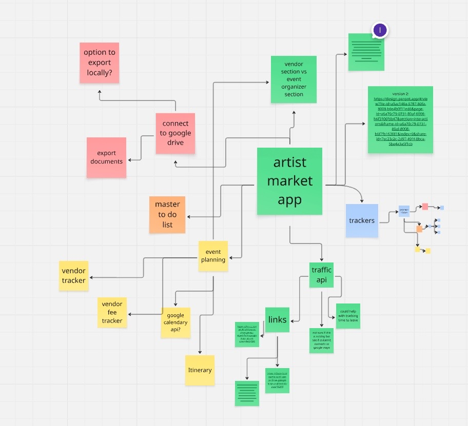
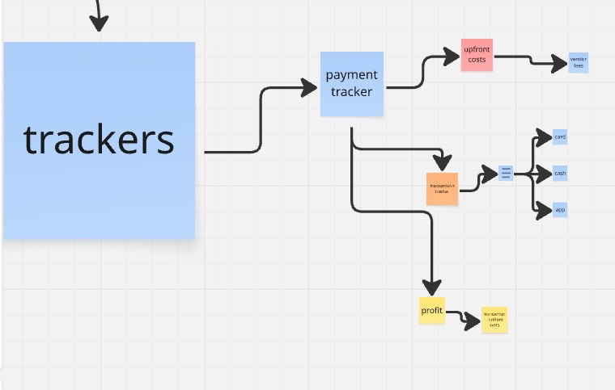
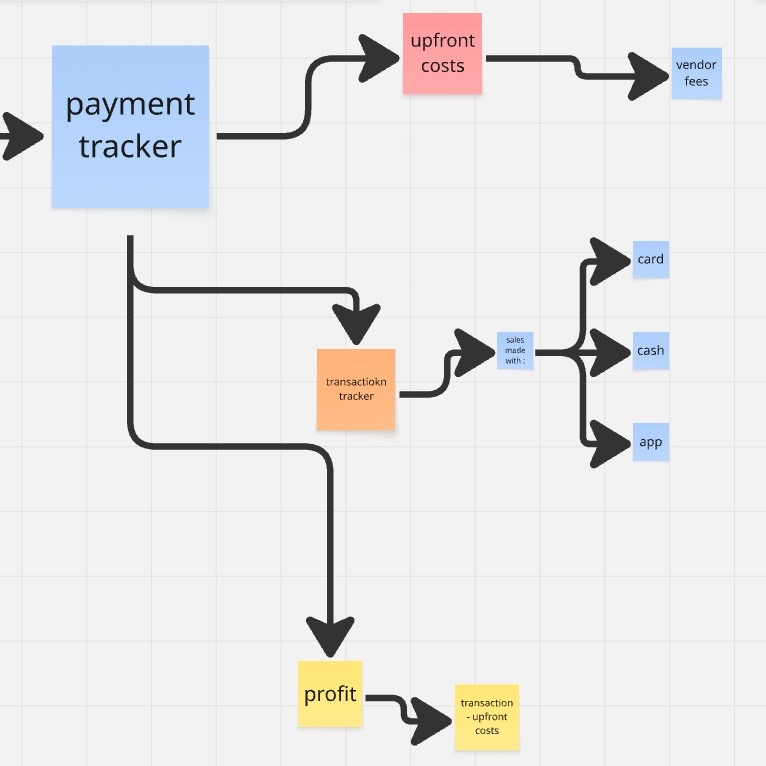
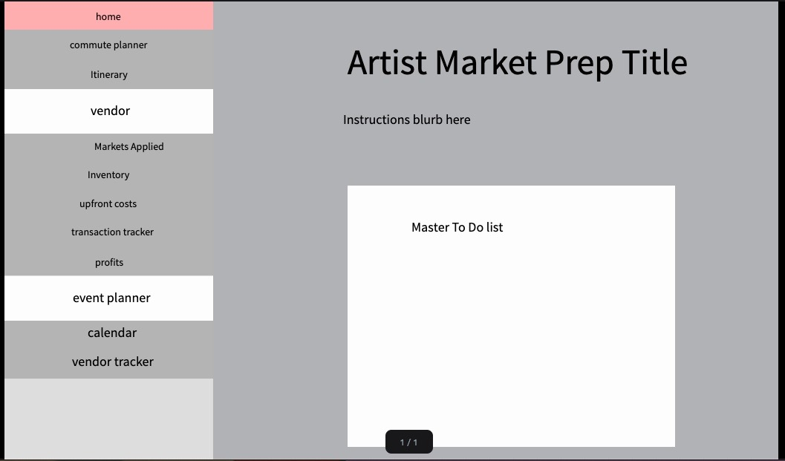

# artmarketprep

This is a web app made in streamlit that is meant to streamline the prep work for artist markets. This will be done in streamlit for availability and ease of access

## Process

### Ideation

I started concepting out some ideas and notes for what I wanted the app to do. This means writing down a list of features and asking some artists what is involved in both the vendor side of planning artist market events and the host side of those same events.

### Visual Planning

After all the ideas are written down. I do some visual planning. I go onto Miro to help plan out those ideas in a way I could visually plan out.

This is the overall visual planning:


This is a closer loook at the payment tracker concept:



I added some useful reference links to, and had the idea of trying to integrate google maps into the app for a commute planner:


### Prototyping

After the flow chart is done, I go onto penpot.app (open source alternative to figma) and make some low fidelity prototypes.

#### First Version

This was the first prototype:
[](https://design.penpot.app/#/view?file-id=24d9d841-759d-81bc-8008-b57cbdfd7117&page-id=24d9d841-759d-81bc-8008-b57cbdfd7118&section=interactions&index=0&share-id=4d62b120-e9f3-4c78-8998-c4c923e34c6a)

#### Second Version

This was the second version:

[](https://design.penpot.app/#/view?file-id=a5ac146a-5787-80fa-8008-b6e4b0f11ed6&page-id=24d9d841-759d-81bc-8008-b57cbdfd7118&section=interactions&index=0&share-id=12794aee-2d06-4290-a9f8-69c020e2f920)

### Code

I build a basic skeleton. There's the Homepage.py file in the root folder. There's all the other pages in the pages folder(still inside the root folder).

<details>
<summary> <h4> Infinite Loop and Wrong File Structure </h4> </summary>

With my original project structure and the use of a dictionary to try to group my navigation pages I had an infinite loop on the homepage. The original file structure looked like this:

```
Root_Folder/
|--- Homepage.py
|---/pages/
|---|--- Calendar.py
|---|--- CommutePlanner.py
|---|--- Inventory.py
|---|--- Itinerary.py
|---|--- MarketsApplied.py
|---|--- Profits.py
|---|--- TransactionTracker.py
|---|--- UpfrontCosts.py
|---|--- VendorTracker.py
```

The dictionary looked like this when Homepage.py was still the entrypoint:

```
pages = {
    "Main":[
        st.Page("pages/Homepage.py", title="Home"),
        st.Page("pages/CommutePlanner.py", title="Commute Planner"),
        st.Page("pages/Itinerary.py", title="Itinerary"),
    ],
    "Vendor": [
        st.Page("pages/MarketsApplied.py", title="Markets Applied"),
        st.Page("pages/Inventory.py", title="Inventory"),
        st.Page("pages/UpfrontCosts.py", title="Upfront Costs"),
        st.Page("pages/TransactionTracker.py", title="Transaction Tracker"),
        st.Page("pages/Profits.py", title="Profits Calculator"),
    ],
    "Event Planner":[
        st.Page("pages/Calendar.py", title="Calendar"),
        st.Page("pages/VendorTracker.py", title="Vendor Tracker"),
    ]
}

page = st.navigation(pages)

page.run()
```

Since Homepage.py was in the dictionary, but also the entry point here, the page.run() made the entrypoint file call itself recursively (until the max number would be reached). So that's bad.

The simple fix was changing the entry point name to a main.py. THe Homepage.py in the Main group of the dictionary would be made into a new file inside the pages folder so the new file structure looked like this:

```
Root_Folder/
|--- main.py
|---/pages/
|---|--- Calendar.py
|---|--- CommutePlanner.py
|---|--- Homepage.py
|---|--- Inventory.py
|---|--- Itinerary.py
|---|--- MarketsApplied.py
|---|--- Profits.py
|---|--- TransactionTracker.py
|---|--- UpfrontCosts.py
|---|--- VendorTracker.py
```

Since Home is up top, it's still the first we page we land on when the main.py entry point is run.

</details>

#### The Homepage

The goal for this page is just a blurb for instructions
